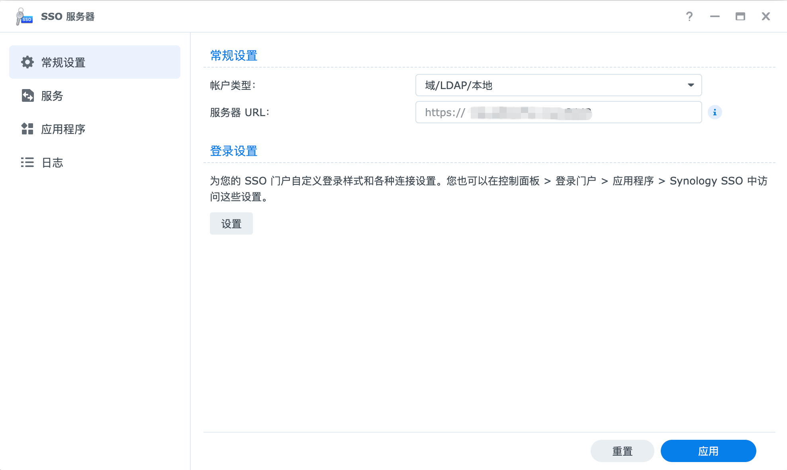
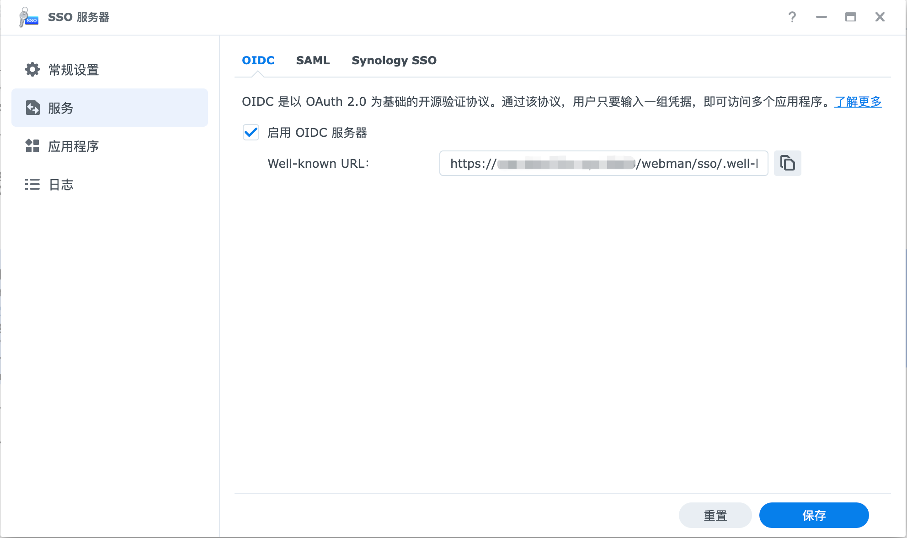
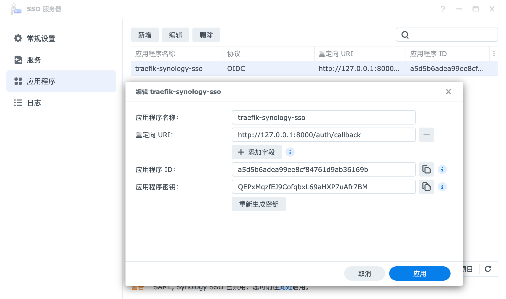

# traefik-synology-sso

基于 FastAPI 实现的 Traefik `forwardAuth` 认证服务，对接 Synology SSO Server（OIDC），为任意 HTTP 后端提供统一登录保护。用户只需登录一次，即可访问多个受保护应用——例如 Traefik Dashboard、ttyd、whoami 等尚未配置认证的服务。

## 工作原理

```
Browser → Traefik → forwardAuth → /auth/verify (本项目)
                                     ↓ 未登录
                               重定向到 Synology SSO 登录页
                                     ↓ 授权成功
                               回调写入 Session → 重定向回原始 URL
                                     ↓ 已登录
                    Traefik 将 X-User-* 头注入并转发到上游服务
```

---

## 1. 在 Synology NAS 上安装 SSO Server

1. 打开 **套件中心**，搜索 **SSO Server**，安装并启动。


2. 进入 **控制面板 → SSO Server → OIDC 提供商**，确认状态为已启用。



3. 点击 **添加应用程序**，填写：
   - **应用程序名称**：任意（如 `traefik-sso`）
   - **重定向 URI**：`https://sso.example.com/auth/callback`（与 `APP_BASE_URL` 的 `/auth/callback` 对应）
   - **访问权限**：按需勾选用户或用户组



4. 保存后记录凭据（Synology 界面与 OIDC 标准术语对应关系如下）：

   | Synology 界面 | 环境变量 | 说明 |
   |---------------|----------|------|
   | **应用程序 ID** | `SYNOLOGY_CLIENT_ID` | 必填 |
   | **应用程序密钥** | `SYNOLOGY_CLIENT_SECRET` | 若界面有显示则必填；部分 DSM 版本不提供此项，留空即可 |

> OIDC 发现文档地址：`https://<NAS_HOST>:<PORT>/webman/sso/.well-known/openid-configuration`

---

## 2. 域名规划

本项目依赖 Session Cookie，**SSO 服务与受保护服务必须处于同一主域**，否则 forwardAuth 拿不到 Cookie。

| 服务 | 示例域名 |
|------|---------|
| 本项目（SSO 中间件） | `sso.example.com` |
| 受保护服务（如 Whoami） | `whoami.example.com` |
| Synology NAS | `nas.example.com`（可跨域，NAS 只作为 OIDC IdP） |

> 若使用 HTTP（本地开发），将 `example.com` 换成 `localhost` 即可。

---

## 3. 配置环境变量

复制 `.env.example` 为 `.env`：

```bash
cp .env.example .env
```

编辑 `.env`：

```dotenv
# Synology NAS 地址（协议 + 主机 + 端口）
SYNOLOGY_BASE_URL=https://nas.example.com

# SSO Server 应用程序 ID（界面显示为「应用程序 ID」）
SYNOLOGY_CLIENT_ID=your_application_id

# 应用程序密钥（界面显示为「应用程序密钥」；若无此项则留空）
SYNOLOGY_CLIENT_SECRET=your_application_secret

# 本项目对外暴露的基础 URL（与 Traefik 路由规则一致）
APP_BASE_URL=https://sso.example.com

# Session 签名密钥，生产环境务必改为随机字符串
SECRET_KEY=change-this-to-a-random-secret-key

# NAS 使用自签名证书时设为 false
SSL_VERIFY=false
```

生成随机 SECRET_KEY：

```bash
python3 -c "import secrets; print(secrets.token_hex(32))"
```

---

## 4. 部署方式

### 方式 A：Docker Compose（Label 方式，推荐）

将 `traefik`、`fastapi-sso` 和受保护服务写在同一个 `docker-compose.yml`：

```yaml
services:
  traefik:
    image: traefik:v3.7
    ports:
      - "80:80"
      - "8080:8080"   # Traefik Dashboard
    volumes:
      - /var/run/docker.sock:/var/run/docker.sock
      - ./traefik/config/traefik.yml:/etc/traefik/traefik.yml
      - ./traefik/dynamic:/etc/traefik/dynamic:ro
      - ./traefik/logs:/var/log/traefik
      - ./traefik/letsencrypt:/etc/traefik/letsencrypt
      - /etc/localtime:/etc/localtime:ro
      - /etc/timezone:/etc/timezone:ro
    networks:
      - proxy

  # SSO 认证服务（本项目）
  synology-sso:
    image: uhub.service.ucloud.cn/allen2fuc/traefik-synology-sso:latest
    environment:
      - SYNOLOGY_BASE_URL=https://nas.example.com
      - SYNOLOGY_CLIENT_ID=your_application_id
      - SYNOLOGY_CLIENT_SECRET=your_application_secret
      - APP_BASE_URL=https://sso.example.com
      - SECRET_KEY=53791833e2c9727dd4d2455411c21ad10d47db30354b0603130f285e207d7573
    expose:
      - "8000"
    networks:
      - proxy

  # 受保护的上游服务示例
  whoami:
    image: traefik/whoami
    networks:
      - proxy

networks:
  proxy:
    external: true
```

> 中间件在 Label 方式下引用格式为 `<名称>@docker`，在 dynamic file 方式下为 `<名称>@file`。

启动：

```bash
docker compose up -d
```

---

### 方式 B：Dynamic File 方式

适合 Traefik 配置与 Docker Compose 分离管理，或需要保护非 Docker 服务的场景。

**`traefik/dynamic.yml`**（已包含在本项目中）：

```yaml
http:
  middlewares:
    synology-sso:
      forwardAuth:
        address: "http://synology-sso:8000/auth/verify"
        authResponseHeaders:
          - "X-User-Sub"
          - "X-User-Name"
          - "X-User-Email"
        trustForwardHeader: true
```

在 Traefik 启动命令或静态配置中加载：

```yaml
# traefik/traefik.yml（静态配置）
providers:
  docker:
    exposedByDefault: false
  file:
    filename: /etc/traefik/dynamic.yml
    watch: true        # 热重载
```

或通过 CLI 参数：

```
--providers.file.filename=/etc/traefik/dynamic.yml
```

受保护服务在 Label 中引用：

```yaml
labels:
  - "traefik.http.routers.myapp.middlewares=synology-sso@file"
```

---

## 5. 验证登录流程

1. 访问 `http://whoami.example.com`。
2. 被重定向到 `http://sso.example.com/auth/login`。
3. 再次重定向到 Synology NAS 的 OIDC 授权页，用 NAS 账户登录。
4. NAS 回调到 `http://sso.example.com/auth/callback`，写入 Session。
5. 自动跳回 `http://whoami.example.com`，请求头携带 `X-User-Name` 等用户信息。

查看当前登录用户：

```bash
curl http://sso.example.com/auth/me
```

健康检查：

```bash
curl http://sso.example.com/health
```

---

## 6. 上游服务获取用户信息

Traefik 会将以下响应头注入到转发给上游服务的请求中：

| Header | 内容 |
|--------|------|
| `X-User-Sub` | OIDC Subject（用户唯一 ID） |
| `X-User-Name` | Synology 用户名 |
| `X-User-Email` | 用户邮箱 |

---

## 7. 注意事项

- **同域要求**：`APP_BASE_URL` 必须与受保护服务处于同一主域（共享 Cookie）。
- **HTTPS**：生产环境建议全程 HTTPS，并将 `app/main.py` 中 `SessionMiddleware` 的 `https_only=True`、`same_site="lax"`。
- **自签证书**：NAS 使用自签证书时，设置 `SSL_VERIFY=false`。
- **应用程序密钥**：若 Synology 界面显示了「应用程序密钥」，请填入 `SYNOLOGY_CLIENT_SECRET`；仅当界面无此项时才留空。
- **登出**：Synology SSO 不支持 `end_session_endpoint`，`/auth/logout` 仅清除本地 Session，NAS 端 Session 在过期前重新访问会自动登录。
